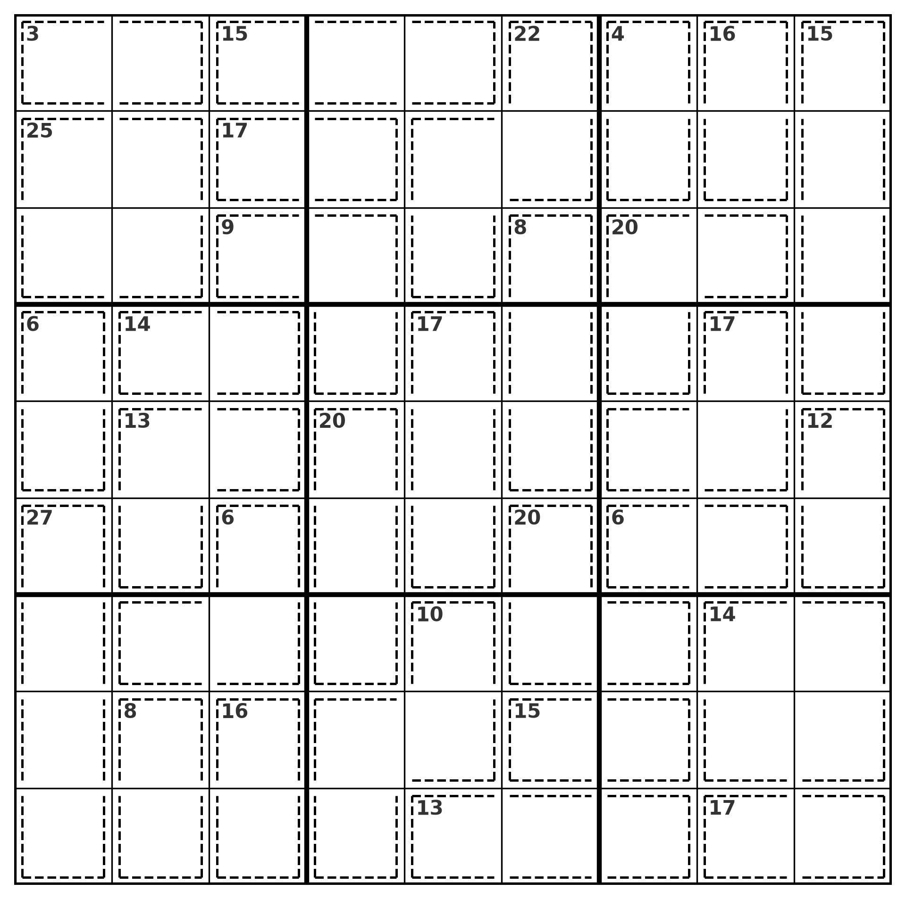
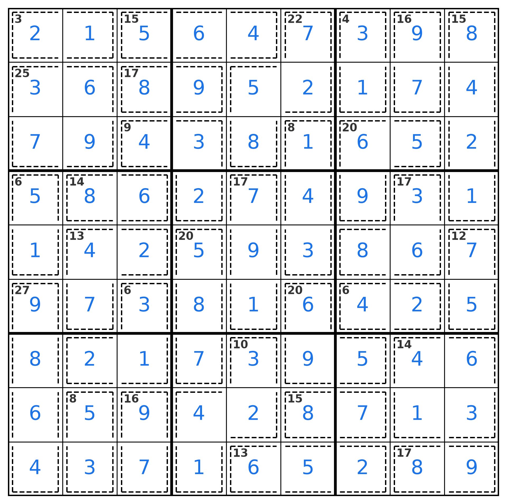
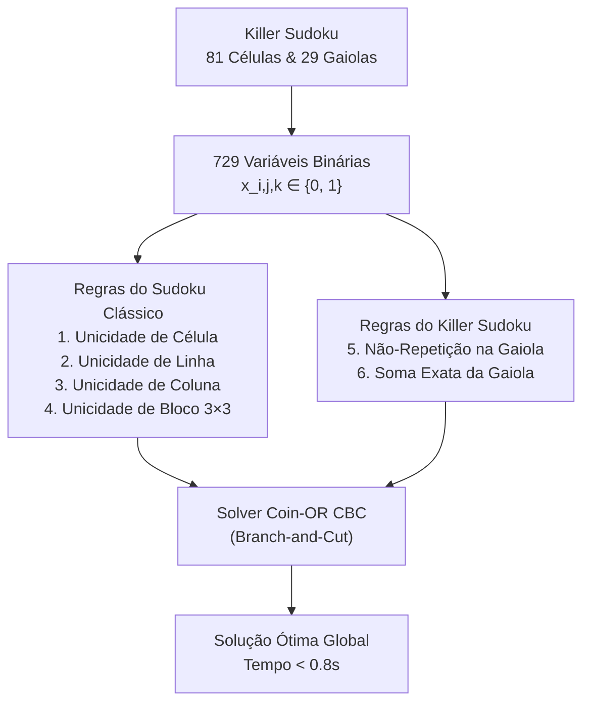

# Resolução de Killer Sudoku via Programação Linear Inteira (PLI)

[](https://www.python.org/)
[](https://coin-or.github.io/pulp/)
[](https://github.com/coin-or/Cbc)
[](LICENSE)

Este projeto aborda a modelagem e resolução exata do jogo combinatório **Killer Sudoku**, formulado como um **Problema de Programação Linear Inteira (PLI)** e Satisfatibilidade de Restrições Binárias (CSP), utilizando a biblioteca **PuLP** e o solver aberto de alta performance **Coin-OR CBC (Branch-and-Cut)**.

> **Origem do Projeto**: Esta solução foi desenvolvida como resolução de um exercício prático proposto no curso de **Ciência de Dados e Pesquisa Operacional (CDPO) da Universidade de São Paulo (USP)**.

---

## Motivação do Projeto

A busca por soluções em problemas combinatórios de grande porte é um desafio central na **Ciência de Dados** e na **Pesquisa Operacional**:

- **Superando a Explosão Combinatória**: Em um grid $9 \times 9$, o espaço de busca bruto por tentativa e erro atinge uma magnitude astronômica de até $9^{81} \approx 1.96 \times 10^{77}$ estados possíveis. Algoritmos ingênuos de *backtracking* recursivo frequentemente demandam tempo de execução exponencial.
- **Poder da Otimização Exata**: Ao formular as regras e somas como um sistema de restrições lineares canônicas sobre variáveis binárias, o resolvedor (*solver*) realiza podas maciças no politopo de soluções através de algoritmos de *Branch-and-Cut* e planos de corte de Gomory, encontrando a **solução ótima e comprovada em menos de 1 segundo**.
- **Ponte com Aplicações Industriais Reais**: A estrutura matemática empregada neste projeto é rigorosamente análoga a desafios corporativos críticos:
  - **Escala de Tripulações e Frotas (*Crew & Fleet Scheduling*)**: Alocação de equipes em companhias aéreas e transporte respeitando janelas de descanso e leis trabalhistas;
  - **Alocação de Horários (*Timetabling*)**: Montagem de grades horárias universitárias e escolares sem conflitos de salas e recursos;
  - **Roteamento Logístico com Restrições (VRPTW)**: Sequenciamento de rotas de distribuição com limites de capacidade e janelas temporais;
  - **Telecomunicações**: Alocação ótima de canais de frequência de rádio prevenindo interferências mútuas.
- **Portabilidade Open Source**: Uso exclusivo de ferramentas abertas (`PuLP` + `Coin-OR CBC`), permitindo reprodução científica e aplicação industrial sem custos de licenciamento comercial.

---

## Demonstração Visual

<div align="center">

| Tabuleiro Inicial (Desafio & Gaiolas) | Solução Ótima Encontrada (PuLP + CBC) |
| :---: | :---: |
|  |  |

</div>

---

## Objetivos do Projeto

- **Modelagem Matemática de Problemas Discretos**: Transformar as regras lógicas de não-repetição e as restrições aritméticas de soma do Killer Sudoku em equações e inequações lineares canônicas.
- **Estruturação de Variáveis de Decisão**: Definir um tensor tridimensional de 729 variáveis binárias $x_{i, j, k} \in \{0, 1\}$ mapeando coordenadas $(i, j)$ e dígitos $k+1$.
- **Formulação de Restrições**:
  - Restrição de atribuição única por célula;
  - Unicidade em cada linha e cada coluna;
  - Unicidade nas 9 subgrades $3 \times 3$;
  - Unicidade de dígitos por gaiola (*cage*);
  - Restrição de soma exata ponderada por gaiola.
- **Otimização Exata vs. Heurística**: Demonstrar como resolvedores de Pesquisa Operacional baseados em *Branch-and-Cut* resolvem instâncias complexas instantaneamente.
- **Visualização Gráfica Customizada**: Construir renderizador gráfico em Matplotlib para desenhar tabuleiros com gaiolas tracejadas e rótulos de soma de forma limpa e profissional.

---

## Regras do Desafio Killer Sudoku

No tabuleiro $9 \times 9$, as regras padrão do Sudoku aplicam-se conjuntamente com partições de células contíguas (gaiolas):
1. Cada célula recebe um único dígito de $1$ a $9$.
2. Cada linha, coluna e bloco $3 \times 3$ deve conter todos os dígitos sem repetição.
3. As 29 gaiolas pré-definidas delimitam grupos de células cuja soma dos valores deve coincidir exatamente com o valor exibido no canto superior.
4. Nenhum número pode se repetir dentro de uma mesma gaiola.

---

## Formulação Matemática



### 1. Variáveis de Decisão
$$x_{i, j, k} \in \{0, 1\}, \quad \forall i, j, k \in \{0, \dots, 8\}$$
$$x_{i, j, k} = 1 \iff \text{célula } (i, j) \text{ recebe o valor } k + 1$$

### 2. Conjunto de Restrições Lineares

1. **Unicidade de Célula**:
   $$\sum_{k=0}^8 x_{i, j, k} = 1, \quad \forall i, j$$

2. **Unicidade de Linha e Coluna**:
   $$\sum_{j=0}^8 x_{i, j, k} = 1 \quad (\forall i, k) \qquad \text{e} \qquad \sum_{i=0}^8 x_{i, j, k} = 1 \quad (\forall j, k)$$

3. **Unicidade de Subgrade $3 \times 3$**:
   $$\sum_{i=0}^2 \sum_{j=0}^2 x_{3I + i, \, 3J + j, \, k} = 1, \quad \forall I, J \in \{0, 1, 2\}, \; \forall k$$

4. **Restrições de Gaiola (Soma e Unicidade)**:
   $$\sum_{(i, j) \in C} x_{i, j, k} \le 1, \quad \forall k, \; \forall C \in \mathcal{C}$$
   $$\sum_{(i, j) \in C} \sum_{k=0}^8 (k + 1) x_{i, j, k} = S_C, \quad \forall C \in \mathcal{C}$$

---

## Resultados da Otimização

- **Status da Solução**: `Optimal` (Ótimo Global Comprovado)
- **Tempo de Execução do Solver**: $< 0.8$ segundos
- **Consistência Numérica**: 
  - Todas as 9 linhas somam exatamente 45;
  - Todas as 9 colunas somam exatamente 45;
  - Todos os 9 blocos $3 \times 3$ contêm a permutação completa de dígitos de 1 a 9;
  - Todas as 29 somas das gaiolas foram satisfeitas com precisão exata.

---

## Principais Conclusões

1. **Eficiência do Branch-and-Cut**: A formulação com 729 variáveis e cortes de planos lineares elimina a necessidade de avaliações combinatórias astronômicas, provando a superioridade da Pesquisa Operacional sobre abordagens ingênuas.
2. **Reprodutibilidade Sem Custos de Licença**: O uso de `pulp.PULP_CBC_CMD` permite que qualquer equipe técnica execute e adapte o código livremente em qualquer sistema operacional.
3. **Generalização para Casos Reais**: A mesma metodologia é diretamente extensível a variantes $16 \times 16$, Sudoku Diagonal e problemas industriais complexos de roteamento e alocação de recursos.

---

## Tecnologias Utilizadas

- **Linguagem**: Python 3.11+
- **Pesquisa Operacional & Otimização**: `pulp` (Coin-OR CBC Solver)
- **Manipulação Numérica**: `numpy`, `itertools`
- **Visualização**: `matplotlib.pyplot`
- **Ambiente**: Jupyter Notebook

---

## Como Executar

1. Clone o repositório:
   ```bash
   git clone https://github.com/CauaValotto/resolucao-killer-sudoku.git
   cd resolucao-killer-sudoku
   ```

2. Instale as dependências:
   ```bash
   pip install -r requirements.txt
   ```

3. Abra e execute o notebook:
   ```bash
   jupyter notebook sudoku.ipynb
   ```

---

## Referência e Contexto Acadêmico

Este projeto integra este portfólio técnico e representa a resolução do exercício de otimização combinatória ministrado no curso de **Ciência de Dados e Pesquisa Operacional (CDPO) da Universidade de São Paulo (USP)**.

